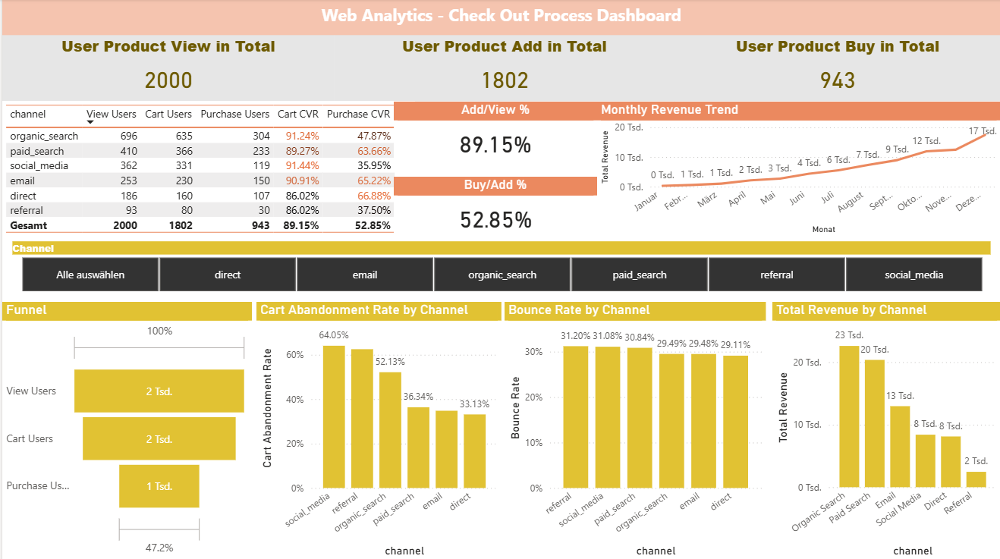

[README.md](https://github.com/user-attachments/files/26944022/README.md)
# Web-Analytics-E-Commerce-PoweBI

## Project Overview

This project analyzes user behavior on an e-commerce platform, focusing on the checkout funnel, channel performance, bounce rates, and revenue trends. The goal is to identify drop-off points in the purchase journey and provide actionable insights for marketing and product teams.

## Tools & Technologies

- **MySQL** – Data storage, querying, and view creation
- **Power BI** – Data modeling, DAX measures, and interactive dashboard
- **Python** – Synthetic dataset generation

## Dataset

A simulated e-commerce dataset covering the full year of 2023, consisting of four tables:

| Table | Rows | Description |
|---|---|---|
| users | 2,000 | User profiles, acquisition channel, device, country |
| sessions | 8,800 | Web sessions with page views, duration, bounce status |
| events | 25,177 | User behavior events (view / cart / purchase) |
| transactions | 1,429 | Completed purchases with revenue and channel data |

## Analysis

### 1. Conversion Funnel
Tracked users across three stages of the purchase journey:
- **View → Cart conversion rate: 89.15%** – Strong product interest across all channels
- **Cart → Purchase conversion rate: 52.85%** – Significant drop-off at checkout stage

### 2. Channel Performance
Analyzed acquisition channels by funnel conversion rate and cart abandonment rate:

| Channel | Cart CVR | Purchase CVR | Cart Abandonment |
|---|---|---|---|
| Direct | 86% | 67% | 33% |
| Email | 91% | 65% | 35% |
| Paid Search | 89% | 64% | 36% |
| Organic Search | 91% | 48% | 52% |
| Referral | 86% | 38% | 62% |
| Social Media | 91% | 36% | 64% |

### 3. Bounce Rate by Channel
All channels show a consistent bounce rate of approximately 29–31%, with Referral and Social Media slightly higher, indicating lower traffic quality from these sources.

### 4. Monthly Revenue Trend
Revenue peaks in **December** (1.9K), consistent with seasonal shopping behavior. A gradual ramp-up is visible from Q3 onward.

## Key Findings

1. **Direct channel has the highest purchase conversion rate (67%)** – Users who navigate directly to the site show the strongest purchase intent.
2. **Social Media has the highest cart abandonment rate (64%)** – Despite a high add-to-cart rate (91%), social media users rarely complete their purchase, suggesting impulse browsing behavior rather than purchase intent.
3. **December drives peak revenue** – Seasonal promotions or holiday demand likely contribute to this spike.
4. **Cart abandonment is the biggest drop-off point** – With an overall abandonment rate of ~47%, targeted cart recovery strategies (e.g., reminder emails) could significantly increase revenue.

## Recommendations

- **For Social Media**: Implement cart abandonment email sequences targeting users who added items but did not purchase.
- **For Referral**: Review referral traffic sources and optimize for higher-quality partnerships.
- **For December**: Prepare inventory and campaign budgets earlier in Q4 to capture the seasonal demand spike.

## Dashboard Preview



*Interactive Power BI dashboard with channel slicer for dynamic filtering across all visuals.*

## SQL Views Created

```sql
-- Overall funnel metrics
funnel_overall: view_users, cart_users, purchase_users, cart_cvr, purchase_cvr

-- Funnel metrics broken down by acquisition channel  
funnel_by_channel: channel, view_users, cart_users, purchase_users, cart_cvr, purchase_cvr
```

## Project Structure

```
├── data/
│   ├── users.csv
│   ├── sessions.csv
│   ├── events.csv
│   └── transactions.csv
├── sql/
│   └── views.sql
├── powerbi/
│   └── ecommerce_dashboard.pbix
└── README.md
```
